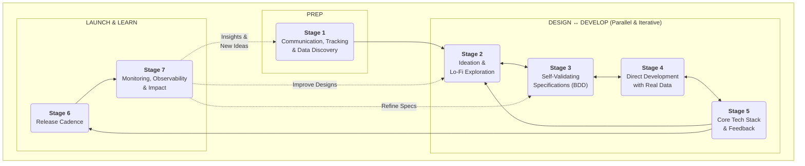

# Tree of Life: A Virtuous Cycle of Adaptive Product Development

**A modern, AI-accelerated process built on decades of experience.**
It merges human-centered design, evolutionary specifications, and real-world data to deliver the right features—faster, leaner, and with higher confidence.

**Built for teams who want to move fast without sacrificing high quality,**

---

## 🌿 Process Stages Overview

The Tree of Life methodology flows through seven **iterative stages**, grouped into three main **phases**. **Design and Development operate in parallel**, with each stage continuously informing the others.

| Phase                | Stage | Name                                     | Purpose                                                                              |
| -------------------- | ----- | ---------------------------------------- | ------------------------------------------------------------------------------------ |
| **Prep**             | 1     | Communication, Tracking & Data Discovery | Establish async workflows and investigate real data conditions.                      |
| **Design ↔ Develop** | 2     | Ideation & Lo-Fi Exploration             | Rapid, low-cost idea exploration. Sketches (even Markdown-powered) live here.        |
|                      | 3     | Self-Validating Specifications           | BDD feature specs that define user journeys and auto-generate test scaffolding.      |
|                      | 4     | Direct Development with Real Data        | Build components in-context with real data and edge cases from day one.              |
|                      | 5     | Core Tech Stack & Feedback               | Shared monorepo tools, data layer, runtime, and real-time stakeholder feedback.      |
| **Launch & Learn**   | 6     | Release Cadence                          | Lightweight, continuous flow of deployment and prioritization.                       |
|                      | 7     | Monitoring, Observability & Impact       | Data-driven feedback loop to validate feature success and improve future iterations. |

Each stage is iterative — teams are encouraged to revisit, refine, and loop back as new insights emerge.

---

## 🧠 Key Philosophy Shifts

* **Human-Centered Design First:** Start with full user journeys, not isolated tasks.
* **Physics of Flow:** Work flows "just in time" with no handoff friction.
* **Context-Native Components:** Built directly in their live data environments.
* **Evolutionary BDD:** Self-validating specs that evolve with usage patterns.
* **Real Data Over Mock Data:** Edge cases are discovered during development.
* **Dual Track Async Design/Dev:** Design informs dev at natural points—not forced checkpoints.
* **Process-as-a-Product:** The methodology itself is subject to feedback and evolution.
* **Event-Driven Documentation:** ADRs captured when decisions happen, not scheduled meetings.
* **AI-Aided Design Sprints:** Compressed into hours not weeks, aided by human-curated AI.
* **Minimal Viable Documentation:** Document where it provides the most value.
* **User-Controlled UI:** Respect system preferences (e.g., dark mode) and avoid anti-features like theme toggles.

---

## 🌱 PREP PHASE

### Stage 1: Communication, Tracking & Data Discovery

Establish a unified system of record for ideas, specs, code, and decisions using GitHub Discussions, Issues, Projects, and Pull Requests. This creates full traceability from ideation to release and supports asynchronous, remote-first collaboration.

In parallel, conduct a **pre-development data audit** to ensure the system starts with a shared understanding of current data reality:

* **Data Inventory & Profiling:** Use tools like `prisma db pull`, AI-assisted schema generators, or exploratory queries to profile existing structures.
* **Quality Baseline:** Define what "clean enough" looks like per key user journeys.
* **Reality Contracts:** Treat the current database schema as a living contract. Evolve it over time rather than attempting perfection upfront.
* **Event-Driven ADRs:** Architectural decisions are captured when they happen, using AI to assist with formatting and clarity.

Example Prisma Schema:

```prisma
model User {
  id       String  @id @default(cuid())
  email    String  @unique
  name     String?
  posts    Post[]
}

model Post {
  id        String   @id @default(cuid())
  title     String
  content   String?
  authorId  String
  author    User     @relation(fields: [authorId], references: [id])
}
```

*NOTE: These processes will be text-based with the goal of increasing automation over time as patterns solidify.*

---

## 🎨 DESIGN ↔ 🔧 DEVELOP PHASE (PARALLEL)

### Stage 2: Ideation & Lo-Fi Exploration

Artifacts at this stage are intentionally low-fidelity and disposable to avoid locking into the wrong design. Paper is cheap but time is money.

Includes sketches, whiteboards, or markdown-based wireframes. The goal is to find the right problem and approach before committing to code. Integrated into GitHub Discussions for visibility.

* **Design Status Tags:** Use `Forming`, `Doing`, and `Done` statuses to manage design iteration.

* **Design Definition of Done:** A sketch or flow is considered "done" when:

  * It solves a validated user problem
  * It aligns with known constraints (data, tech, UX)
  * It is peer-reviewed and accepted into the discussion board
  * It is clearly documented in markdown, Figma, or embedded artifact
  * It’s ready to promote to spec (Stage 3)

* **Markdown-Powered Sketching:** Use [**Mermaid**](https://mermaid-js.github.io/) or [**Markmap**](https://markmap.js.org/) to create diagrams directly in Discussions or markdown files:

  ````markdown
  ```mermaid
  flowchart TD
    A[Start] --> B{User decision}
    B -->|Click X| C[Path A]
    B -->|Click Y| D[Path B]
  ```
  ````

* **Cross-Stage Visibility:** When validated, sketches can be preserved in `design-archive/` folders or linked to specs.

* **AI-Aided Variation:** Prompt AI to generate alternative flows for comparison:

  > “Generate three design variations for onboarding that reduce drop-off at step two.”

* **Iterative by Design:** Expect to return to this stage as specs or components raise new insights.

### Stage 3: Self-Validating Specifications

*Bridge between design and development, where user intent becomes executable truth.*

Stage 3 formalizes validated design ideas into executable, living specifications. These take the form of human-readable `.feature` files using **Behavior-Driven Development (BDD)**, which define complete user journeys in plain language. These specs double as documentation and automated tests, ensuring every feature delivers clear value and is always tested against real expectations.

#### 📄 The Spec Format

Specs are written in [Gherkin](https://cucumber.io/docs/gherkin/) syntax:

```gherkin
Feature: User onboarding flow

  Scenario: New user completes signup
    Given a visitor is on the homepage
    When they click "Get Started"
    And they fill out the registration form
    Then they should see a welcome screen
```

* **Feature:** The high-level user value
* **Scenario:** A single outcome or journey path
* **Given/When/Then:** The sequence of user behavior and expected results

#### ✅ What Makes a Spec "Done"?

A self-validating spec is considered ready when:

* The problem is validated via Design (Stage 2)
* The journey is expressed in plain language and testable steps
* It includes real-world edge cases (e.g. bad input, missing data)
* It is peer-reviewed and merged into the `specs/` folder
* It runs as a Playwright or Cucumber test
* It passes with current data or raises intentional failures for edge cases

#### 🧐 UX-Risk-Based Testing Strategy

Not all features need the same rigor. Testing intensity scales with the user experience impact and novelty:

| UX Risk    | Example Features                | Testing Strategy                                         |
| ---------- | ------------------------------- | -------------------------------------------------------- |
| **Low**    | Standard login, pagination      | BDD + visual smoke test                                  |
| **Medium** | Onboarding wizard, payment flow | BDD + device matrix + accessibility checks               |
| **High**   | Complex dashboards, dynamic UIs | BDD + session replay + user testing + analytics tracking |

This approach saves effort on boilerplate while focusing deeply on what's risky or novel.

#### 🛠️ Tools & Integration

* **Playwright + Cucumber:** Automates `.feature` specs as browser-based end-to-end tests
* **Test Runs in CI:** Every commit runs all passing `.feature` files using real or seeded data
* **PR Hooks:** Specs required for any new feature before merge
* **Fallback Tests (Optional):** Manual or snapshot tests for visual diffing, etc.

#### ♻️ Evolutionary Feedback Loop

* Failed tests signal **spec drift**—revisit design or refine the expectation
* Usage analytics (Stage 7) inform spec updates
* AI can suggest edits or identify untested paths

Example AI prompt:

> “Suggest missing scenarios in the user onboarding flow based on top user session patterns.”

*NOTE: These specs and tests are not static. They are refined over time as user data and real usage provide new insight.*

---

### Stage 4: Direct Development with Real Data

Stage 4 is where code meets reality. Instead of developing components in isolation with mock data, we build them **directly in the Next.js application context**, using real schemas and live or seeded data. This ensures every feature is grounded in truth, resilient to edge cases, and continuously informed by how users actually interact.

#### 🧬 Context-Native Development

* Components are built **inside their intended context**, not abstracted sandboxes.
* Instead of "design to dev handoff," the developer works from the spec and real user data simultaneously.
* Edge cases are surfaced automatically, not weeks later during QA.
* Flow between spec (Stage 3) → component → feedback (Stage 5) is seamless.

#### 📚 Design System in Code

Instead of a separate design token file or Figma library, the system evolves in the codebase:

* **Design Tokens via Tailwind**: Define consistent colors, spacing, etc.
* **Linting for Consistency**: Enforce rules like spacing, typography, or a11y
* **Docs generated from spec and displayed in Component Book (kitchen sink)**: Each component documented where it lives

```tsx
// tailwind.config.ts
export const theme = {
  extend: {
    colors: {
      primary: "#10b981", // Emerald
    },
  },
};
```

```tsx
// Example component doc block
/**
 * Button Component
 * @example <Button intent="primary">Click me</Button>
 */
```

#### ✅ "Done" Definition for Components

A component is considered complete when:

* It fulfills a corresponding `.feature` scenario
* It handles both typical and messy real-world data
* It uses tokens, styles, and patterns from the shared system
* It is covered by an automated test or manual test case
* It’s reviewed in a PR with a Vercel preview or similar
* It gracefully degrades if data is missing or invalid

#### 🔁 Bidirectional Flow

* **Upstream to Design:** Building reveals missing states or complexity → Design (Stage 2) revisits flows.
* **Downstream to Feedback:** Working code is immediately deployed for review in Stage 5.

```tsx
// UserCard.tsx
export function UserCard({ user }: { user: User }) {
  return (
    <b className="p-4 border rounded">
      <h2>{user.name ?? "Unnamed User"}</h2>
      <p>{user.email}</p>
    </b>
  );
}
```

```ts
// Sample data injection in page
const user = await prisma.user.findFirst({ where: { email: "demo@example.com" } });
return <UserCard user={user} />;
```

---

### Stage 5: Core Tech Stack & Real-Time Feedback

This stage provides the foundational technology, infrastructure, and feedback mechanisms that power fast, reliable development and ensure stakeholder visibility into progress and quality.

#### Tech Stack Highlights

* **Monorepo with Turborepo:** Enables sharing components, BDD specs, utilities, and data contracts between clean and legacy projects. Supports incremental builds and remote caching optimized for Vercel deployments.

* **Data Layer - Prisma:** Type-safe ORM that connects your database schema to your application code. It acts as the single source of truth for data models, providing a seamless bridge between the database and frontend.

* **Database - Vercel Postgres:** Fully managed, scalable PostgreSQL database optimized for Vercel. Supports instant deployments and scales transparently.

* **Framework - Next.js (App Router):** Industry-standard React framework offering server-side rendering, incremental static regeneration, and edge functions for performance and scalability.

* **Language - TypeScript:** Strongly typed superset of JavaScript ensuring type safety and improved developer experience.

* **Styling - Tailwind CSS:** Utility-first CSS framework for rapid UI development with enforced design system consistency.

* **Security & Quality:** Integrated Dependabot, CodeQL static analysis, and other tools catch vulnerabilities early.

#### Feedback & Workflow Integration

* **Vercel Preview Deployments:** Every branch gets an instant, shareable preview environment. Stakeholders can interact with real functionality and provide early feedback.

* **Pull Request Comments:** Integrated with previews, allowing contextual discussion on changes.

* **Automated CI Tests:** Playwright & Cucumber specs run on every push, validating that features match specs in real data environments.

* **Shared Component Library:** Encourages reuse and design consistency. Changes propagate through the monorepo with version control.

* **Real-Time Monitoring Hooks:** Enables feature flag toggling and quick rollback if needed.

#### Iteration & Improvement

* This stage continuously evolves alongside the other stages, with tech stack upgrades, testing enhancements, and feedback mechanisms refined over time.
* Stakeholder feedback loops ensure alignment and reduce costly rework downstream.

---

### Stage 6: Release Cadence

The Release Cadence stage operationalizes delivery. Instead of heavyweight release trains, Tree of Life emphasizes small, safe, and frequent releases driven by feature readiness—not calendar dates. This enables faster feedback, reduces risk, and allows teams to stay focused on user value.

#### 🚀 Continuous Delivery, Not Continuous Chaos

* **CI/CD Pipelines:** Every merge deploys to staging; production behind feature flags.
* **Release by Feature, Not Sprint:** A feature is released when it's validated—not when the calendar says so.
* **Feature Toggles:** Use tools like ConfigCat, Flagsmith, or custom environment toggles to control exposure.
* **Progressive Rollouts:** Gradually enable features for internal users → beta group → everyone.

#### 🛎 Prioritization Flow

* **Triage Board:** GitHub Projects or similar reflects current work and readiness.
* **Decision-Making Criteria:** Value, risk, user demand, complexity.
* **Stakeholder Involvement:** Releases shared as preview links with light commentary for business review.

#### 🧰 Tools

* **Vercel / Netlify / Railway:** Instant deploy previews and simple rollback.
* **ConfigCat / Flagsmith / LaunchDarkly:** Feature flagging platforms.
* **Github Projects / Linear:** Workflow and prioritization boards.

#### 🔁 Feedback to Prior Stages

* Real feedback from feature use helps improve specs (Stage 3) and designs (Stage 2).
* Rollout metrics inform future architecture and observability needs (Stage 5–7).
* Minor UX issues surfaced here are triaged back into Stage 1 discussions.

#### ✅ "Done" Means Shipped & Stable

A feature is considered complete at this stage when:

* It’s deployed to production with appropriate flags or rollouts
* It’s observed in the wild via metrics or behavior
* It meets the original spec criteria and generates no critical errors
* It’s documented in changelogs or release notes
* It’s safe to move on without debt or ambiguity

---

### Stage 7: Monitoring, Observability & Impact

This final stage ensures that deployed features deliver the intended value and feed actionable insights back into the cycle. By monitoring real-world usage and surfacing impact metrics, teams can validate assumptions, detect regressions, and refine priorities.

#### 📊 Feature Impact Monitoring

* **Core Metric Tracking:** Tie each feature to one or more measurable outcomes: usage rate, conversion, retention, satisfaction, etc.
* **Observability Hooks:** Implement structured logging and analytics events at key user touchpoints.
* **Session Replay (Optional):** Use tools like Highlight or LogRocket to view edge cases visually.

#### 🧪 Outcome Validation

* **Compare Actual vs Intended:** Each feature’s success is measured against its original BDD spec intent.
* **Alert on Drift:** Sudden changes in behavior, performance, or engagement trigger follow-up reviews.
* **Experimentation:** A/B test feature variants to optimize outcomes.

#### 📈 Tools

* **PostHog / Plausible / Amplitude:** Event-based user behavior analytics.
* **Highlight / Sentry / LogRocket:** Frontend session recording and error tracking.
* **Grafana / Prometheus:** System-level performance and uptime metrics.
* **Playwright Traces:** Detect regressions in test coverage over time.

#### 🔁 Feedback to All Stages

Insights from this stage flow backward:

* Back to **Design**: Real user behavior reveals missed assumptions.
* Back to **Specs**: Behavior patterns or regressions suggest updates to `.feature` files.
* Back to **Tech Stack**: Errors or bottlenecks suggest architectural improvements.

#### ✅ “Done” Means Verified

A feature’s lifecycle completes when:

* It has demonstrable impact or insight (positive or negative)
* It has confirmed metrics aligned with its original goal
* Its learnings inform the next iteration, spec, or design

### Below is a more complex spec. that may be our first T0L homemade tool?



```gherkin

Feature: Component Inspector
  As a developer working on the application
  I want to inspect and browse components directly in the dev environment
  So that I can quickly reference documentation and variants without leaving my development context

  Background:
    Given I am in development mode
    And the application is running locally

  Scenario: Opening component inspector with floating button
    Given I am viewing any page in the application
    When I look at the bottom-right corner of the screen
    Then I should see a floating blue button with a layers icon
    When I click the floating button
    Then the component inspector panel should open from the right side
    And I should see a list of all available components

  Scenario: Opening component inspector with keyboard shortcut
    Given I am viewing any page in the application
    When I press "Cmd+Shift+C" (or "Ctrl+Shift+C" on Windows/Linux)
    Then the component inspector panel should open from the right side
    And I should see a search input at the top
    And I should see a list of all available components below

  Scenario: Searching for components
    Given the component inspector is open
    And I can see components like "Button", "UserCard", "Modal" in the list
    When I type "but" in the search input
    Then I should only see components that contain "but" in their name or description
    And the "Button" component should be visible
    And other components should be filtered out

  Scenario: Viewing component details
    Given the component inspector is open
    And I can see a list of components
    When I click on the "Button" component
    Then I should see the component detail view
    And I should see a back button to return to the component list
    And I should see the component name "Button" as a heading
    And I should see the component description
    And I should see a variant selector dropdown
    And I should see code preview for the selected variant

  Scenario: Browsing component variants
    Given I am viewing the "Button" component details
    And the variant selector shows "Primary" as selected
    When I change the variant selector to "Secondary"
    Then the code preview should update to show the secondary button code
    And the code should be syntax highlighted
    And I should see '<Button variant="secondary">Cancel</Button>' in the preview

  Scenario: Viewing related feature specs
    Given I am viewing a component's details
    And the component has related BDD feature files
    Then I should see a "Related Specs" section
    And I should see file icons next to each spec filename
    And the spec filenames should be clickable links

  Scenario: Closing the inspector with close button
    Given the component inspector is open
    When I click the X button in the top-right corner
    Then the inspector panel should close
    And I should see the floating button again

  Scenario: Closing the inspector with escape key
    Given the component inspector is open
    When I press the "Escape" key
    Then the inspector panel should close
    And I should see the floating button again

  Scenario: Closing the inspector with backdrop click
    Given the component inspector is open
    When I click on the dark backdrop area outside the panel
    Then the inspector panel should close
    And I should see the floating button again

  Scenario: Navigating back to component list
    Given I am viewing a specific component's details
    When I click the "← Back to Components" button
    Then I should return to the component list view
    And I should see all components listed again
    And my previous search term should be preserved

  Scenario: Inspector is hidden in production
    Given the application is running in production mode
    When I visit any page
    Then I should not see the floating component inspector button
    And pressing "Cmd+Shift+C" should not open any inspector panel

  Scenario: Component count and spec indicators
    Given the component inspector is open
    And I can see the component list
    When I look at each component card
    Then I should see the number of variants for each component
    And I should see the number of related specs for each component
    And these should be displayed with appropriate icons

  Scenario: Keyboard shortcuts help
    Given the component inspector is open
    When I look at the bottom of the panel
    Then I should see keyboard shortcut hints
    And I should see "⌘⇧C to toggle" and "ESC to close"
    And the shortcuts should be displayed in styled kbd elements

  Scenario: Responsive behavior
    Given the component inspector is open
    And I resize the browser window
    Then the inspector panel should maintain its fixed width
    And the floating button should remain in the bottom-right corner
    And the panel should remain accessible and usable

  Scenario: Component data loading
    Given the component inspector is first opened
    When the component discovery system is loading
    Then I should see a loading state or skeleton
    And once loaded, I should see all discovered components
    And components should be sorted alphabetically by name

  Scenario: Error handling for missing components
    Given the component inspector is open
    And there are no components discovered
    When I look at the component list
    Then I should see an appropriate empty state message
    And I should see guidance on how to add component documentation

  Scenario: Code syntax highlighting
    Given I am viewing a component's variant code
    When I look at the code preview
    Then JSX syntax should be highlighted appropriately
    And the code should be formatted in a monospace font
    And it should have a dark theme with green text on dark background
```
